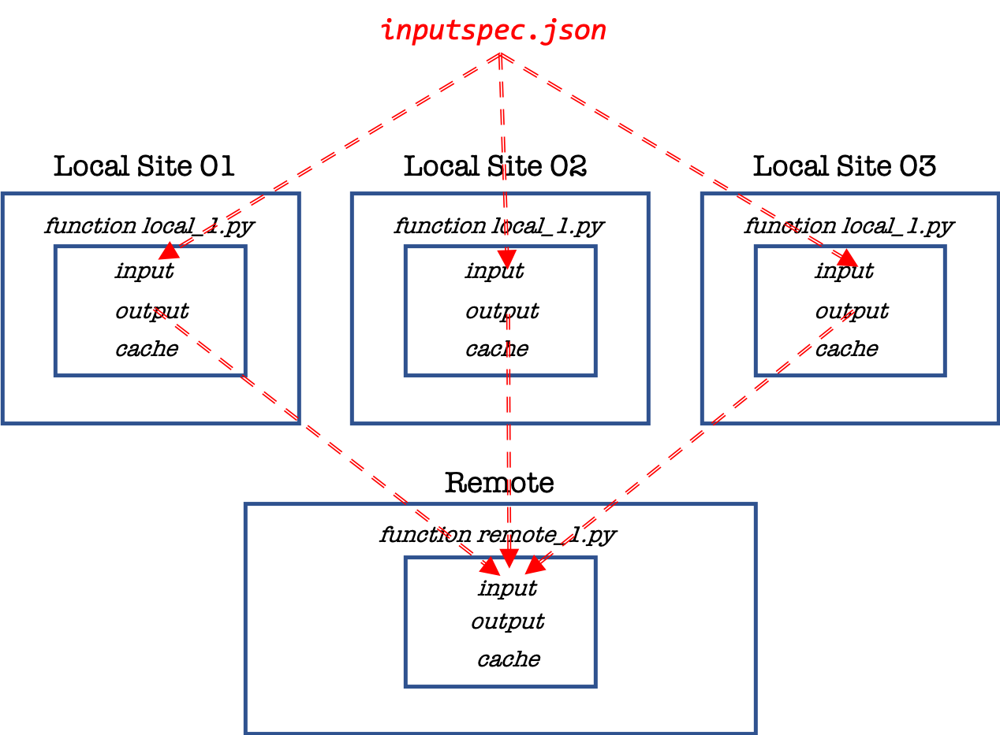

# Summary

Central to the field of neuroimaging is the development of techniques for making 
sense of complex brain data. However, rapid technological advancements are pushing 
the spatial and temporal resolution of imaging in different modalities to a never 
before seen level leading to large datasets which cannot be worked out in a traditional 
desktop computing paradigm. This has led to a paradigm shift in scientific research 
increasing the emphasis on collaborative data-sharing. However, current approaches to 
data-sharing such as negotiating multiple data sharing agreements, can be cumbersome. 
In addition, there are also significant data transfer, organization and computational 
challenges. The bottomline being collaborative group research requires a great deal of 
coordination. Human and business factors can hamper research from happening at a pace 
that we are able to handle, maybe even forbidding group research to occur at all.

# Software
``COINSTAC`` [@plis2016coinstac] is a web-based framework titled Collaborative Informatics and Neuroimaging 
Suite Toolkit for Anonymous Computation that addresses the aforementioned issues. It provides a platform
to analyze data stored locally across multiple organizations without the need for pooling the data at any point 
during the analysis, aka decentralization. It is intended to be an ultimate one-stop shop by which researchers can build 
statistical [@ming2017coinstac] or machine learning models [@gazula2018decentralized] collaboratively in a decentralized fashion. This framework 
implements a message passing infrastructure that allows large scale analysis of decentralized data 
with results on par with those that would have been obtained if the data were in one place. Because
there is no pooling of data, it can technically guarantee the privacy of individual datasets. However, we also offer differentially private algorithms for enhanced protection. Differential privacy is a framework to control the risk that individual data points can be inferred from the output of the algorithm [@dwork2014algorithmic]. Computations can be local or decentralized and are deployed using a containerized model. we also offer a simulation environment for algorithm developers to build COINSTAC computations. These computations can then be made available within the COINSTAC platform.

# Related Work
In the past, data-specific collaborative efforts included either aggregating the data via a centralized data sharing repository or sharing data via agreement based collaborations. Frameworks such as ENIGMA [@thompson2014enigma] to some extent bypass the need for data agreements by performing a centrally coordinated analysis at each local site. Another framework called ViPAR [@carter2016vipar] tries to go one step further by, relying on open-source technologies, completely isolating the data at the local site but only pooling them via transfer to perform automated statistical analyses. However, the heterogeneity among the local analyses caused by adopting various data collection mechanisms or preprocessing methods can lead to inaccurate meta-analysis findings. Other tools like CBRAIN [@sherif2014cbrain], Loris [@das2012loris], XNAT [@herrick2016xnat], OpenNeuro [@gorgolewski2017openneuro] exist in literature but we do not do a more detailed comparison as COINSTAC is, to our knowledge, the first of its kind application platform enabling decentralized analysis of brain imaging data. 

# Features
``COINSTAC`` removes the barriers to collaborative analysis by:

1. decentralizing analyses and computation

* Each user performs analyses/pipelines/etc all on their own computers. bits and pieces of each users' output may be sent to a central compute node. Over a dozen local and decentralized computations/algorithms have been developed already with more coming.

* A central compute node performs a complimentary component of the group analysis by coordinating between the various data nodes participating in a consortium. This node may trigger adjusted computations on users' machines, generally in effort to improve a model.

2. Not synchronizing full datasets. instead, synchronizing only aggregate level analysis metrics (e.g. the gradients of a machine learning algorithm)

* As previously discussed, central compute nodes aggregate these metrics, and help the user draw conclusions from the contributor swarm

* Because machine learning algorithms can be designed to model outcomes via artifacts of your analysis Pipelines, we keep your data safely and conveniently on your own machine, technically untouched.

3. Applying differential privacy strategies to further enhance anonymization of private data, whilst still permitting collaboration.

# Acknowledgements

This work was funded by the National Institutes of Health (grant numbers: R01EB005846, 1R01DA040487,
P20GM103472/5P20RR021938) and the National Science Foundation (grant numbers: 1539067 and 1631819).
In addition, the authors would like to acknowledge the efforts of many unnamed personnel over the years
who contributed to the development of ``COINSTAC``. In addition, the authors would like to acknowledge the contributions of Jing Ming, Sandeep R. Panta, Eswar Damaraju, Anees Abrol, Torran Kahleck, Dylan Wood, Chris Dieringer, Drew Landis, Cory Reed.

# References